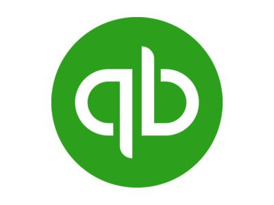
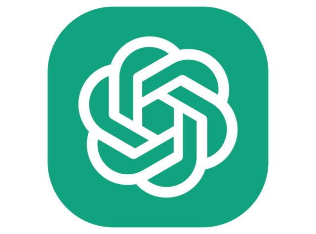
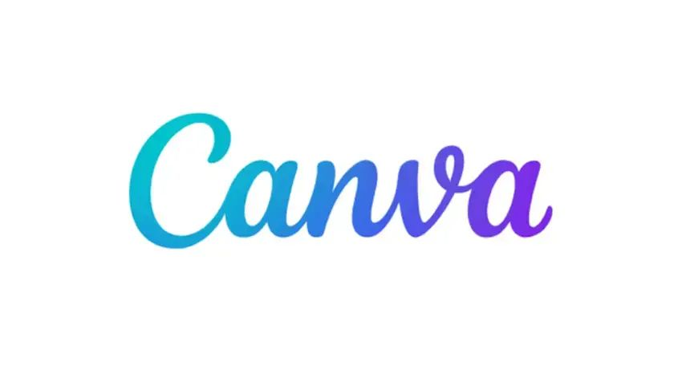

<!DOCTYPE html>
<html lang="en">
<head>
<meta charset="UTF-8">
<meta name="viewport" content="width=device-width, initial-scale=1.0">
<title>Michelle Gonzales | Administrative & Financial Operations</title>

<link href="https://fonts.googleapis.com/css2?family=Poppins:wght@300;400;600&family=Roboto+Slab:wght@400;700&display=swap" rel="stylesheet">

<link rel="stylesheet" href="https://cdnjs.cloudflare.com/ajax/libs/font-awesome/6.0.0/css/all.min.css">

</head>

<body>

<nav>
  <a href="#about">Profile</a>
  <a href="#services">Expertise</a>
  <a href="#portfolio">Sample Works</a>
  <a href="#workflow">Workflow</a>
  <a href="#tools">Tools</a>
  <a href="#faq">FAQ</a>
  <a href="#contact">Contact</a>
</nav>

<header>
  <h1>Michelle Gonzales</h1>
  
Administrative • Accounts Receivable • Bookkeeping • Payroll Support

  

    <a href="https://www.linkedin.com/in/michgonzalesva" target="_blank" class="linkedin-btn"><i class="fab fa-linkedin"></i> LinkedIn</a>
    <a href="https://wa.me/639654033089" target="_blank" class="whatsapp-btn"><i class="fab fa-whatsapp"></i> WhatsApp</a>
    <a href="https://cal.com/michgonzalesva" target="_blank" class="book-btn"><i class="fas fa-calendar"></i> Book Discovery Call</a>
  

</header>

<section id="about">
  
  

    <h2>Operational Partner</h2>
    
I specialize in streamlining back-office operations and financial documentation. While I have a strong command of accounting fundamentals, I am currently onboarding QuickBooks into my service suite to provide clients with modern, cloud-based reporting and real-time financial tracking.

    
    
  

</section>

<section id="value">
  <h2>Professional Advantage</h2>
  

    
<i class="fas fa-check-circle"></i>
<h3>Corporate Discipline</h3>
Structured documentation and organized records.

    
<i class="fas fa-check-circle"></i>
<h3>Process Organization</h3>
Reliable workflows for business operations.

    
<i class="fas fa-check-circle"></i>
<h3>Reliable Communication</h3>
Professional support across teams.

  

</section>

<section id="services">
  <h2>Core Expertise</h2>
  

    
<h3>Executive Administration</h3>
Email organization, scheduling, document management.

    
<h3>Bookkeeping Support</h3>
Transaction documentation and financial record organization. (Learning QuickBooks)

    
<h3>Accounts Receivable</h3>
Invoice tracking and payment monitoring.

    
<h3>Payroll Documentation</h3>
Organizing payroll records and salary tracking.

  

</section>

<section id="portfolio">
  <h2>Sample Works & Reports</h2>
  

    

      

      

        QuickBooks Online
        <h3>Profit & Loss Statement</h3>
        
Generated monthly financial reports to track net income and operating expenses accurately.

      

    

    

      

      

        QuickBooks Online
        <h3>Expense Categorization</h3>
        
Organization of daily transactions into proper chart of accounts for tax readiness.

      

    

    

      

      

        Financial Tracking
        <h3>A/R Aging Reports</h3>
        
Monitoring outstanding invoices to ensure healthy cash flow and timely payments.

      

    

  

</section>

<section id="workflow">
  <h2>Client Onboarding Workflow</h2>
  

    

1
<h3>Discovery Call</h3>
Discuss business workflow and needs.

    

2
<h3>System Setup</h3>
Secure access and operational alignment.

    

3
<h3>Trial Week</h3>
1-week paid trial collaboration.

    

4
<h3>Full Support</h3>
Long-term administrative support.

  

</section>

<section id="tools">
  <h2>Tech Stack</h2>
  

    

QuickBooks (Learning)

    

Excel

    

Google Workspace

    

ChatGPT

    

Canva

    

Microsoft 365

  

</section>

<section id="faq">
  <h2>Frequently Asked Questions</h2>
  

    

Do you offer trial work?<i class="fas fa-chevron-down"></i>

Yes. I offer a 1-week paid trial to ensure workflow compatibility.

    
    

        
How do you handle QuickBooks if you are currently learning it?<i class="fas fa-chevron-down"></i>

        
While I am perfecting the software interface, I have a strong foundation in <strong>Accounting Fundamentals</strong>. I understand debits, credits, and the accounting cycle. The "learning" is simply mastering the QuickBooks system shortcuts—the math and accuracy behind your reports remain my top priority.

    

    

        
What is the financial advantage of hiring you now?<i class="fas fa-chevron-down"></i>

        
Hiring me at this stage allows you to get high-level administrative support at a <strong>growth-friendly rate</strong>. You receive an operational partner who already understands financial logic, saving you the high cost of a senior firm while getting the same level of care.

    

    

Which timezones do you support?<i class="fas fa-chevron-down"></i>

I work with businesses across US, UK, and Australian timezones.

    

Payment methods?<i class="fas fa-chevron-down"></i>

Payments can be made via bank transfer or PayPal depending on agreement.

  

</section>

<section class="cta" id="contact">
  <h2>Let's Organize Your Growth</h2>
  
Delegate your administrative burden and focus on scaling your business. Ready to see how we can work together?

  
  <a href="https://cal.com/michgonzalesva" target="_blank" class="btn-cta">
    <i class="fas fa-calendar-check"></i> Book Your Discovery Call
  </a>

  

    <a href="mailto:mitchgonzales.career@gmail.com" class="cta-contact-item">
      <i class="fas fa-envelope"></i> mitchgonzales.career@gmail.com
    </a>
    <a href="https://wa.me/639654033089" target="_blank" class="cta-contact-item">
      <i class="fab fa-whatsapp"></i> +63 965 403 3089
    </a>
    <a href="https://www.linkedin.com/in/michgonzalesva" target="_blank" class="cta-contact-item">
      <i class="fab fa-linkedin"></i> LinkedIn Profile
    </a>
  

</section>

<a href="https://wa.me/639654033089" target="_blank" class="whatsapp-float"><i class="fab fa-whatsapp"></i></a>

</body>
</html>
