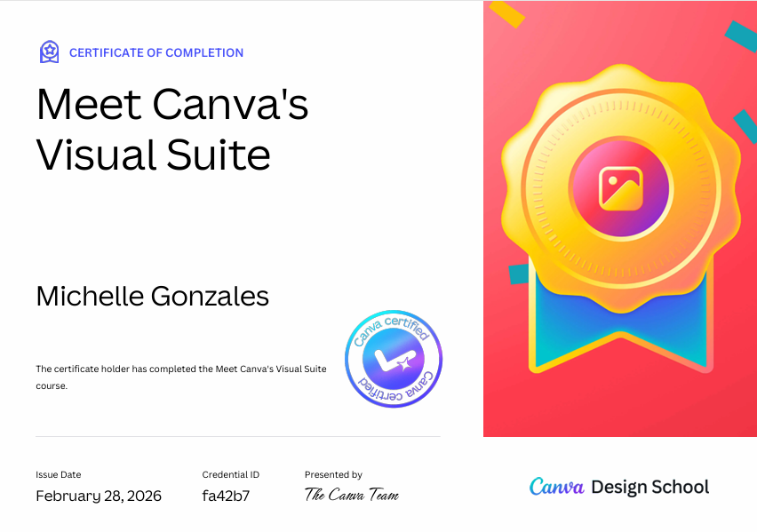
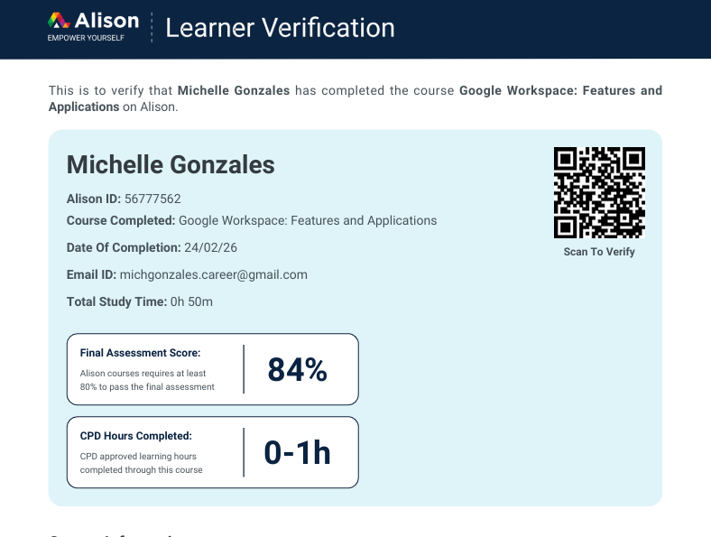
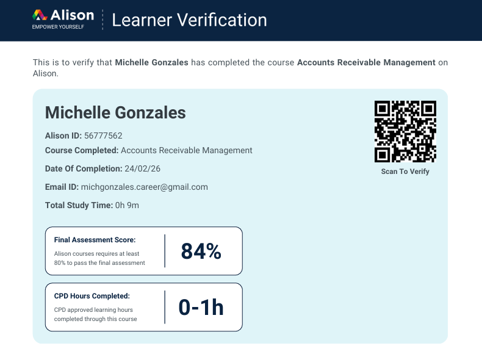
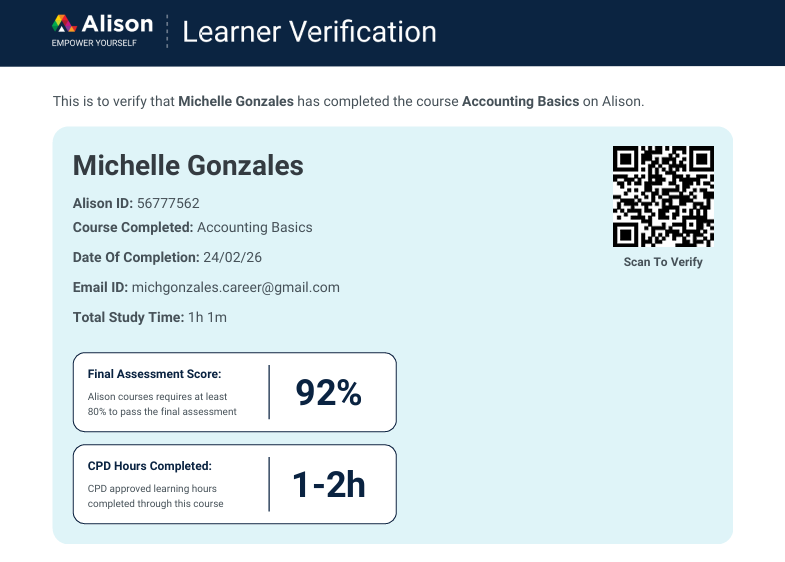
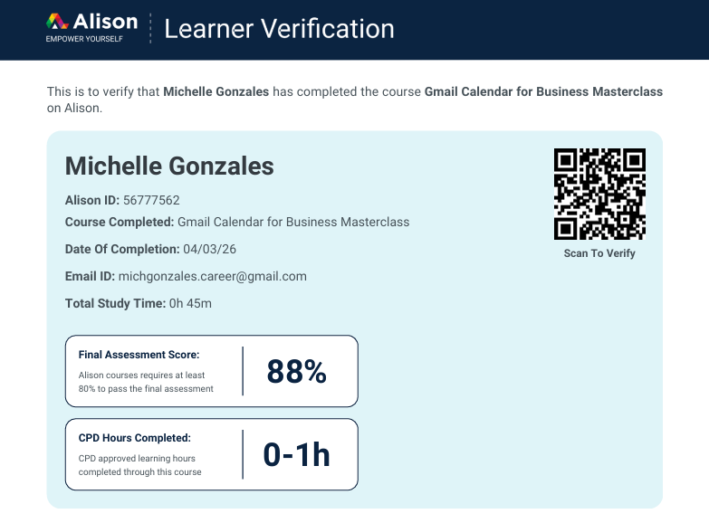
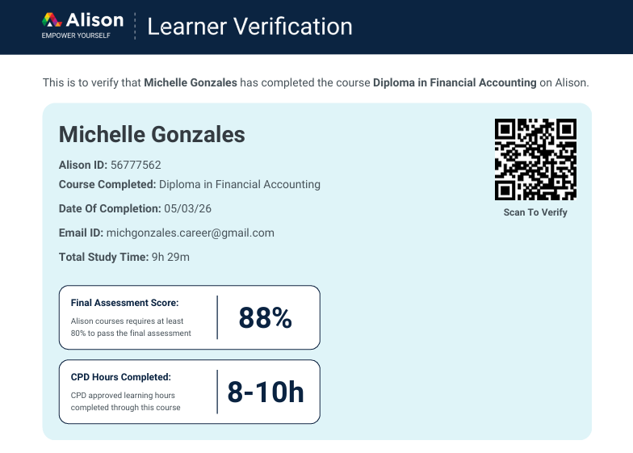

<!DOCTYPE html>
<html lang="en">
<head>
<meta charset="UTF-8">
<meta name="viewport" content="width=device-width, initial-scale=1.0">
<title>Michelle Gonzales | Administrative & Financial Operations</title>

<link href="https://fonts.googleapis.com/css2?family=Poppins:wght@300;400;600&family=Roboto+Slab:wght@400;700&display=swap" rel="stylesheet">
<link rel="stylesheet" href="https://cdnjs.cloudflare.com/ajax/libs/font-awesome/6.0.0/css/all.min.css">

</head>

<body>

<!-- NAV -->
<nav>
  <a href="#about">Profile</a>
  <a href="#value">Advantage</a>
  <a href="#services">Expertise</a>
  <a href="#workflow">Workflow</a>
  <a href="#tools">Tools</a>
  <a href="#certs">Certifications</a>
  <a href="#faq">FAQ</a>
  <a href="https://www.linkedin.com/in/michgonzalesva" target="_blank">LinkedIn</a>
</nav>

<!-- HERO -->
<header>
  <h1>Michelle Gonzales</h1>
  
Administrative • Accounts Receivable • Bookkeeping • Payroll Support

  

    <a href="https://www.linkedin.com/in/michgonzalesva" target="_blank" class="linkedin-btn"><i class="fab fa-linkedin"></i> LinkedIn</a>
    <a href="https://wa.me/639654033089" target="_blank" class="whatsapp-btn"><i class="fab fa-whatsapp"></i> WhatsApp</a>
    <a href="https://cal.com/michgonzalesva" target="_blank" class="book-btn"><i class="fas fa-calendar"></i> Book Discovery Call</a>
  

</header>

<!-- ABOUT -->
<section id="about">
  
  

    <h2>Operational Partner</h2>
    
I provide administrative and financial documentation support for businesses that need reliable back-office organization. My focus is building structured workflows that keep records organized and easy to manage.

    
I am currently expanding my bookkeeping skills and continuing to develop my QuickBooks knowledge while supporting clients with documentation, financial tracking, and administrative coordination.

  

</section>

<!-- PROFESSIONAL ADVANTAGE -->
<section id="value">
  <h2>Professional Advantage</h2>
  

    
<i class="fas fa-check-circle"></i>
<h3>Corporate Discipline</h3>
Structured documentation and organized records.

    
<i class="fas fa-check-circle"></i>
<h3>Process Organization</h3>
Reliable workflows for business operations.

    
<i class="fas fa-check-circle"></i>
<h3>Reliable Communication</h3>
Professional support across teams.

  

</section>

<!-- CORE EXPERTISE -->
<section id="services">
  <h2>Core Expertise</h2>
  

    
<i class="fas fa-user-tie"></i><h3>Executive Administration</h3>
Email organization, scheduling, document management.

    
<i class="fas fa-book"></i><h3>Bookkeeping Support</h3>
Transaction documentation and financial record organization.

    
<i class="fas fa-file-invoice-dollar"></i><h3>Accounts Receivable</h3>
Invoice tracking and payment monitoring.

    
<i class="fas fa-calculator"></i><h3>Payroll Documentation</h3>
Organizing payroll records and salary tracking.

  

</section>

<!-- WORKFLOW -->
<section id="workflow">
  <h2>Client Onboarding Workflow</h2>
  

    

1
<h3>Discovery Call</h3>
Discuss business workflow and needs.

    

2
<h3>System Setup</h3>
Secure access and operational alignment.

    

3
<h3>Trial Week</h3>
1-week paid trial collaboration.

    

4
<h3>Full Support</h3>
Long-term administrative support.

  

</section>

<!-- TOOLS -->
<section id="tools">
  <h2>Tech Stack</h2>
  

    

QuickBooks (Learning)

    

Excel

    

Google Workspace

    

ChatGPT

    

Canva

    

Microsoft 365

  

</section>

<!-- CERTIFICATIONS -->
<section id="certs">
  <h2>Professional Certifications</h2>
  

    

Canva Visual Suite

    

Bookkeeping

    

Journalizing

    

Google Workspace

    

AR Management

    

Accounting Basics

    

Executive Admin

    

Financial Accounting

  

</section>

<!-- FAQ -->
<section id="faq">
  <h2>Frequently Asked Questions</h2>
  

    

      
Do you offer trial work?<i class="fas fa-chevron-down"></i>

      
Yes. I offer a 1-week paid trial to ensure workflow compatibility.

    

    

      
Which timezones do you support?<i class="fas fa-chevron-down"></i>

      
I work with businesses across US, UK, and Australian timezones.

    

    

      
How do clients schedule appointments?<i class="fas fa-chevron-down"></i>

      
Clients can book directly via <a href="https://cal.com/michgonzalesva" target="_blank">Cal.com</a>.

    

    

      
What is your payment method?<i class="fas fa-chevron-down"></i>

      
Payments can be made via bank transfer or PayPal depending on agreement.

    

    

      
What software do you use?<i class="fas fa-chevron-down"></i>

      
I use QuickBooks, Excel, Google Workspace, ChatGPT, Canva, and Microsoft 365.

    

  

</section>

<!-- CTA -->
<section class="cta">
  <h2>Ready to streamline your business operations?</h2>
  <a href="https://cal.com/michgonzalesva" target="_blank" class="btn">Book a Discovery Call</a>
</section>

<!-- FLOATING WHATSAPP -->
<a href="https://wa.me/639654033089" target="_blank" class="whatsapp-float"><i class="fab fa-whatsapp"></i></a>

</body>
</html>
