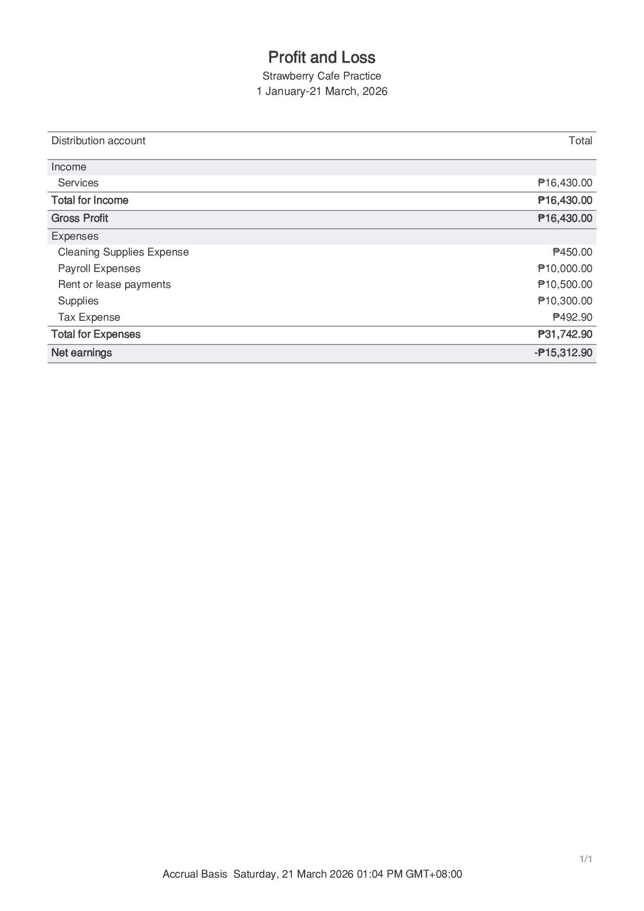

<!DOCTYPE html>
<html lang="en">
<head>
<meta charset="UTF-8">
<meta name="viewport" content="width=device-width, initial-scale=1.0">
<title>Michelle Gonzales | Administrative & Financial Operations</title>

<link href="https://fonts.googleapis.com/css2?family=Poppins:wght@300;400;600&family=Roboto+Slab:wght@400;700&display=swap" rel="stylesheet">
<link rel="stylesheet" href="https://cdnjs.cloudflare.com/ajax/libs/font-awesome/6.0.0/css/all.min.css">

</head>

<body>

<nav>
    <a href="#about">Profile</a>
    <a href="#services">Expertise</a>
    <a href="#portfolio">Sample Works</a>
    <a href="#workflow">Workflow</a>
    <a href="#tools">Tools</a>
    <a href="#certifications">Certifications</a>
    <a href="#faq">FAQ</a>
    <a href="#contact">Contact</a>
</nav>

<header>
    <h1>Michelle Gonzales</h1>
    
Administrative • Accounts Receivable • Bookkeeping • Payroll Support

    

        <a href="https://www.linkedin.com/in/michgonzalesva" target="_blank" class="linkedin-btn"><i class="fab fa-linkedin"></i> LinkedIn</a>
        <a href="https://wa.me/639654033089" target="_blank" class="whatsapp-btn"><i class="fab fa-whatsapp"></i> WhatsApp</a>
        <a href="https://cal.com/michgonzalesva" target="_blank" class="book-btn"><i class="fas fa-calendar"></i> Book Discovery Call</a>
    

</header>

<section id="about">
    

        

            
            

                <h2>Operational Partner</h2>
                
I specialize in streamlining back-office operations and financial documentation. While I have a strong command of accounting fundamentals, I am currently onboarding QuickBooks into my service suite to provide clients with modern, cloud-based reporting and real-time financial tracking.

            

        

    

</section>

<section id="value">
    

        

            <h2>Professional Advantage</h2>
            

                
<i class="fas fa-check-circle"></i>
<h3>Corporate Discipline</h3>
Structured documentation and organized records.

                
<i class="fas fa-check-circle"></i>
<h3>Process Organization</h3>
Reliable workflows for business operations.

                
<i class="fas fa-check-circle"></i>
<h3>Reliable Communication</h3>
Professional support across teams.

            

        

    

</section>

<section id="services">
    

        <h2>Core Expertise</h2>
        

            
<h3>Executive Administration</h3>
Email organization, scheduling, document management.

            
<h3>Bookkeeping Support</h3>
Transaction documentation and financial record organization. (Learning QuickBooks)

            
<h3>Accounts Receivable</h3>
Invoice tracking and payment monitoring.

            
<h3>Payroll Documentation</h3>
Organizing payroll records and salary tracking.

        

    

</section>

<!-- --- PORTFOLIO WITH 5 ITEMS --- -->
<section id="portfolio">
    

        <h2>Sample Works & Reports</h2>
        

            <!-- Profit & Loss -->
            

                

                    
                

                

                    QuickBooks Online
                    <h3>Profit & Loss Statement</h3>
                    
Mock monthly Profit & Loss report showing income, expenses, and net profit for a sample business.</
